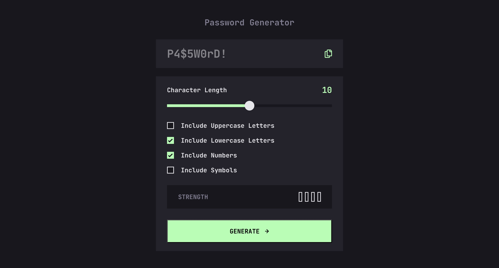

# Frontend Mentor - Password generator app solution

This is a solution to the [Password generator app challenge on Frontend Mentor](https://www.frontendmentor.io/challenges/password-generator-app-Mr8CLycqjh). Frontend Mentor challenges help you improve your coding skills by building realistic projects.

## Table of contents

-   [Overview](#overview)
    -   [The challenge](#the-challenge)
    -   [Screenshot](#screenshot)
    -   [Links](#links)
-   [My process](#my-process)
    -   [Built with](#built-with)
    -   [What I learned](#what-i-learned)
-   [Author](#author)

### The challenge

Users should be able to:

-   Generate a password based on the selected inclusion options
-   Copy the generated password to the computer's clipboard
-   See a strength rating for their generated password
-   View the optimal layout for the interface depending on their device's screen size
-   See hover and focus states for all interactive elements on the page

### Screenshot



### Links

-   Solution URL: [Solution URL](https://github.com/Joshk7/password-generator)
-   Live Site URL: [Live Site URL](https://password-generator-pearl-phi.vercel.app)

## My process

I started by building out the html and css, then adding JavaScript. However, I took a step back when trying to style the main range input slider. I had to add a bit of JavaScript to make the background to the left of the thumb scrubber a lime color. Additionally, I had to set appearance to none for some inputs so that default browser styles wouldn't interfere. Specifically for checkboxes, I had to explicitly set border-radius to 0 because checkboxes have rounded corners on Safari.

### Built with

-   Semantic HTML5 markup
-   CSS custom properties
-   Flexbox
-   CSS Grid
-   Mobile-first workflow

### What I learned

I learned how to use javascript to style backgrounds based on a percentage that calculates were a linear gradient switches color.

```js
const handleSliderInput = (e) => {
    const { min, max, value } = rangeSlider;
    const total = Number(max) - Number(min);
    const percent = ((Number(value) - Number(min)) / total) * 100;
    const offset = thumbWidth / 2 / 100;
    e.target.style.background = `linear-gradient(to right, var(--lime-green) 0%, var(--lime-green) ${
        percent - offset
    }%, var(--black) ${percent - offset}%, var(--black) 100%`;
    sliderValue.textContent = value;
};
```

This code snippet shows how the website dynamically calculates the current percentage of the slider input's value and then assigns the background color of lime green up to that point and the rest black.

## Author

-   Website - [Joshua Kahlbaugh](https://joshuakahlbaugh.pages.dev)
-   Frontend Mentor - [@JoshK7](https://www.frontendmentor.io/profile/JoshK7)
